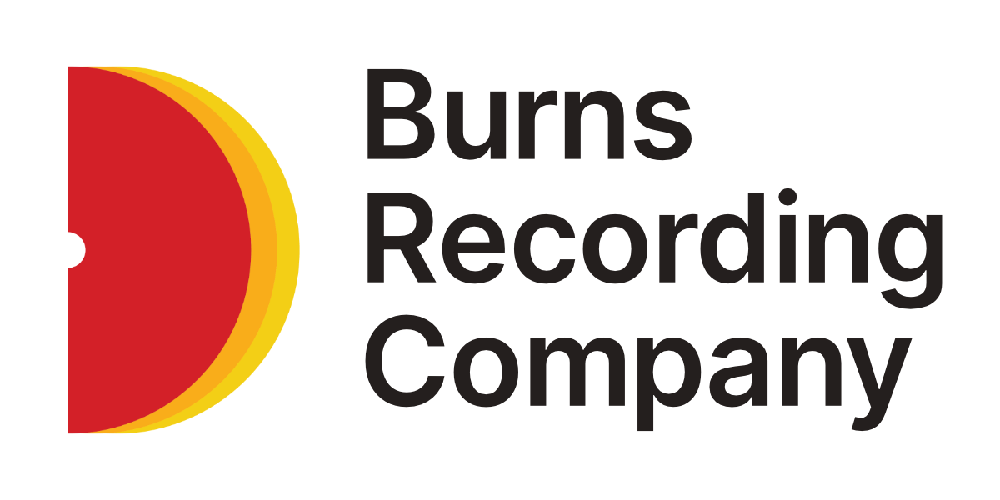

# PL-10

Simple self-hosted audio streaming for the web

Just drop your files in the `media` folder and start the server.

## Contents

- <a href="#demo">Demo</a>
- <a href="#usage">Usage</a>
- <a href="#setup">Setup</a>
- <a href="#startup">Startup</a>
  - <a href="#build-the-server">Build the server</a>
  - <a href="#start-the-server">Start the server</a>
- <a href="#configuration">Configuration</a>
  - <a href="#set-the-page-title">Set the page title</a>
  - <a href="#set-the-page-subtitle">Set the page subtitle</a>
  - <a href="#set-supporting-text">Set the supporting text</a>
  - <a href="#media-directory">Media Directory</a>
  - <a href="#max-file-number">Maximum file number</a>
- <a href="#customization">Customization</a>
  - <a href="#front-end">Front End</a>
  - <a href="#back-end">Back End</a>
- <a href="#libraries-and-other-references">Libraries and other references</a>

## Demo

There is an interactive demo running at: https://pl-10.x.burns.fm

Note: the machine its running on is not suited for large audiences, so performance may not be ideal.

## Usage

> **Notes on mobile compatibility:** Some effort has been made so far to be mobile-friendly.
> There are still glitches in playback, seeking, and less importantly, displaying the visualizer.
> This is due to differences between browser implementation of the [Web Audio API](https://developer.mozilla.org/en-US/docs/Web/API/Web_Audio_API).

## Setup

Install all of the dependencies:

```sh
npm install
```

## Startup

Once the packages are installed you'll need to build the server code and start it up.

### Build the server
```sh
npm run build:server
```

### Build the client/UI

If you start the server and the buttons don't seem to do anything, you probably forgot to to this step.

```sh
npm run build:client
```

If you want to rebuild the styles only then run

```sh
npm run build:client:styles
```

If you want to see your changes on the page as you edit the styles, then while your server is running, run this command in another terminal window to auto-compile your styles every time you save:

```sh
npm run watch:client:styles
```

### Start the server
Start the server in production mode
```sh
npm start
```

Start the server in development mode
```sh
npm run start:dev
```

### Debug Mode
This will enable additional logging if you're running into any trouble. It might help diagnose the problem.

```sh
npm run start:debug
```

## Configuration

Some settings configuration is possible if you want to make some minor changes to how things are run.

- <a href="#set-the-page-title">Set the page title</a>
- <a href="#set-the-page-subtitle">Set the page subtitle</a>
- <a href="#set-supporting-text">Set the supporting text</a>
- <a href="#media-directory">Media Directory</a>
- <a href="#maximum-file-number">Maximum File Number</a>

> **Note:** *The custom values below have a limited set of characters they can support. Characters like*
> *double-quotes (`"`), dollar signs (`$`), and others will need to be 'escaped' in order to work correctly.*
> *For that reason, if you want more flexibility then you should edit the template file directly.*
> <div><small>The splash template: `/views/includes/splash.ejs`</div>

### Set the page title

<details>
<summary>
Default Value
</summary>
<div>PL_10_PAGE_TITLE="BRC PL-10"</div>
<div>
The media directory included in this repository at the root.
</div>
</details>

If you want to use the default layout and set the title text, use the following environment variable `PL_10_PAGE_TITLE`.

Use this for the main page text. Ideal for an artist name or album name, or short promo text. It will also be used for the browser page title (that will show up on the tab).

### Set the page subtitle

<details>
<summary>
Default Value
</summary>
<div>PL_10_PAGE_SUBTITLE="Web Player"</div>
</details>

If you want to use the default layout and set the subtitle text, use the following environment variable `PL_10_PAGE_SUBTITLE`.

Use this for an artist name or album name. Something like that.

### Set supporting text

<details>
<summary>
Default Value
</summary>
<div>PL_10_SUPPORTING_TEXT="Simple, self-hosted streaming"</div>
</details>

If you want to use the default layout and set the supporting text, use the following environment variable `PL_10_SUPPORTING_TEXT`.

Use this if you have some extra info you want to include like a promotional tagline, shout-out, or release date.

### Copyright notice

<details>
<summary>
Default Value
</summary>
<div>None</div>
</details>

#### Example

> &copy; 2023 `<your-text-here>`. All rights reserved.

If you want to use the default layout and set the copyright text, use the following environment variable `PL_10_COPYRIGHT`.

The copyright symbol and date are already set for you, so just add any more text you'd like.

> **Note:** *To change this text in more detail, you can edit the footer*
> *template: `/views/includes/footer.ejs`*

### Media Directory
<summary>
Default Value
<details>
<div>PL_10_MAX_FILES=media</div>
<div>
The media directory included in this repository at the root.
</div>
</details>
</summary>

You can set an alternative media directory by setting the environment variable `PL_10_MEDIA_DIR` to where your files are stored. Only

### Maximum file number
<summary>
Default Value
<details>
<div>
PL_10_MAX_FILES=10
</div>
</details>
</summary>

By default, the server has a maximum number of files it will pick up. You can override that number by setting `PL_10_MAX_FILES` to a different number.

## Customization

### Front End

You can change several things about the look of the page.

  * Player and other functional code: <a href="./client/README.md">See the readme</a>
  * Player and page styles, colours, fonts: <code>TODO</code>

### Back End

If you are familiar with JavaScript, HTTP, NPM workflows, then you should find changing the backend functionality relatively simple.

In-depth documentation won't be included with PL-10 at launch, but if you know what you're doing, the best starting point is the set of scripts in `package.json` and the files in the `./server` folder.

## Libraries and other references

This project uses several open source fonts, code libraries, and icon sets.

If you need to understand how to work with some of the files included, you might find more information in the list below.

| Name | URL | Usage |
| --- | --- | --- |
| Inter | <a href="https://rsms.me/inter/" target="_blank">https://rsms.me/inter/</a> | Titles, body test, small footer text, etc.
| JD LCD Rounded | <a href="https://jeckodevelopment.com/fonts/jd-lcd-rounded" target="_blank">https://jeckodevelopment.com/fonts/jd-lcd-rounded</a> | Player display components |
| Feather Icons | <a href="https://feathericons.com" target="_blank">https://feathericons.com</a> | Player transport and other icons |
| TypeScript | <a href="https://www.typescriptlang.org" target="_blank">https://www.typescriptlang.org</a> | Programming language used for the client and server code|
| ExpressJS | <a href="https://expressjs.com" target="_blank">https://expressjs.com</a> | HTTP Server framework |
| music-metadata | <a href="https://github.com/borewit/music-metadata" target="_blank">https://github.com/borewit/music-metadata</a> | Parsing metadata from audio files |
| EJS | <a href="https://ejs.co" target="_blank">https://ejs.co</a> | HTML-based templating language used for setting up the `views` files |
| SASS/SCSS | <a href="https://sass-lang.com" target="_blank">https://sass-lang.com</a> | The style language used for customizing the look of the HTML (see `./public/app/styles/scss`) |


---

&copy; 2022 <a href="https://burns.fm">BRC</a>
